# LWS

LWS is a compact C++26 windowing layer. It provides portable window lifecycle, input, event, cursor, timer,
clipboard, drag-and-drop, and bitmap-presentation APIs while keeping native backend behavior behind explicit
platform boundaries.

## Supported platforms

| Platform | Backend | Status |
| --- | --- | --- |
| Windows | Win32 | Supported |
| Linux | Wayland | Supported when the Wayland development packages and protocols are available |
| Linux | X11 | Scaffold only; no window backend is currently provided |

Applications can query optional behavior with `LWS::Platform::supports` rather than assuming that every backend
implements every feature.

## Build

LWS requires CMake 3.20 or newer and a compiler with the C++26 mode used by the project.

```sh
cmake -S . -B build -DLWS_BUILD_TESTS=ON
cmake --build build
ctest --test-dir build --output-on-failure
```

Embed LWS with `add_subdirectory` and link the `LWSLib` target:

```cmake
add_subdirectory(path/to/LWS)
target_link_libraries(your_application PRIVATE LWSLib)
```

## Quick start

```cpp
#include <LWS/Platform.hpp>
#include <LWS/Window.hpp>

int main()
{
    const LWS::Platform::Session platform;
    if (!platform)
        return 1;

    LWS::Window window;
    const LWS::WindowConfig config{
        .size = {800, 600},
        .styles = LWS::WindowStyle::Caption | LWS::WindowStyle::CloseButton,
        .visible = true,
    };
    if (window.Create(config) != LWS::Result::Success)
        return 1;

    LWS::Platform::runMessageLoop();
    return 0;
}
```

## Design Decision

### Portable Core with Opt-in Platform-Specific Extensions

```mermaid
flowchart LR
    subgraph portable["Portable path"]
        shared["Shared consumer<br/>Platform-neutral application code"]
        window["LWS::Window<br/>LWS::AnyEvent"]
        behavior["Portable backend behavior<br/>Lifecycle, input, semantic events"]
        shared --> window --> behavior
    end

    subgraph extension["Opt-in platform-specific path"]
        consumer["Cross-platform consumer<br/>#ifdef LWS_PLATFORM_*<br/>Visible platform policy"]
        api["LWS::Window.hpp<br/>Auto-includes active extension<br/>LWS::&lt;Platform&gt;::Extension(...)"]
        backend["Selected platform backend<br/>Owns platform behavior<br/>Translates native events"]
        event["Typed platform event or operation<br/>Example: Win32::PaintEvent &#123; HDC, Rect &#125;"]
        consumer --> api
        api -->|Matching BackendId<br/>Private checked downcast| backend
        backend -.-> event -.-> consumer
    end
```



The public API deliberately has two layers:

- `LWS::Window` and `LWS::AnyEvent` form the portable abstraction used by shared application code.
- Namespaces such as `LWS::Win32` provide the opt-in platform-specific extension API for consumers already
  compiled in that platform's context.

`LWS/Window.hpp` conditionally includes the active platform extension declarations. A cross-platform consumer
can therefore guard a platform operation at the policy point where it matters without managing another include.
Inside LWS, the extension verifies the matching `BackendId`, privately downcasts to the selected backend, and
delegates the behavior to it. The consumer does not receive backend objects or perform casts.

This is intentionally a hybrid abstraction. Native concepts are not disguised as portable types, and their use
is confined to explicit platform guards or platform-specific source files. The tradeoff is visible platform
coupling for consumers that need native behavior in exchange for direct, efficient access without publishing
backend objects. New typed platform events and operations should be added only for concrete consumers; portable
behavior remains in `AnyEvent`.

| Decision | Benefit | Tradeoff |
| --- | --- | --- |
| Auto-include the active `LWS::<platform>` extension from `Window.hpp` | Consumers use one standard include and keep guarded policy calls visible | A platform build of `Window.hpp` also exposes that platform's native declarations and dependencies |
| Accept `LWS::Window&` in extension functions | Consumers do not receive backend objects or perform casts | LWS must verify the matching `BackendId` and privately downcast |
| Dispatch through the platform's `BackendId` and a private `static_cast` | Extension setup avoids RTTI and keeps casts inside LWS | Correctness depends on the built-in backend ID/type invariant |
| Use typed platform-event alternatives | Native payloads and lifetimes are explicit | Each new alternative expands that platform's public API |

### Example: Win32 paint callback

A cross-platform consumer can guard the Win32 operation directly while continuing to include only
`LWS/Window.hpp`:

```cpp
#ifdef LWS_PLATFORM_WIN32
std::ignore = LWS::Win32::SetPlatformCallback(
    window,
    [](const LWS::Win32::PlatformEvent& event) -> std::optional<LRESULT>
    {
        if (const auto* paint = std::get_if<LWS::Win32::PaintEvent>(&event))
        {
            DrawSidebar(paint->deviceContext, paint->invalidRect);
            return 0;
        }
        return std::nullopt;
    });
#endif
```

Each window stores one `PlatformCallback`; registering another replaces it, and an empty callback clears it. For
`WM_PAINT`, LWS creates `Win32::PaintEvent` after `BeginPaint`. Its `HDC` is valid only while the callback paints
synchronously, and LWS calls `EndPaint` before emitting the portable `EventPaint`.

## Repository layout

| Path | Purpose |
| --- | --- |
| `src/LWS/include/LWS` | Public headers and platform extension headers |
| `src/LWS/source` | Portable implementation and native backends |
| `tests` | Unit and platform integration tests |
